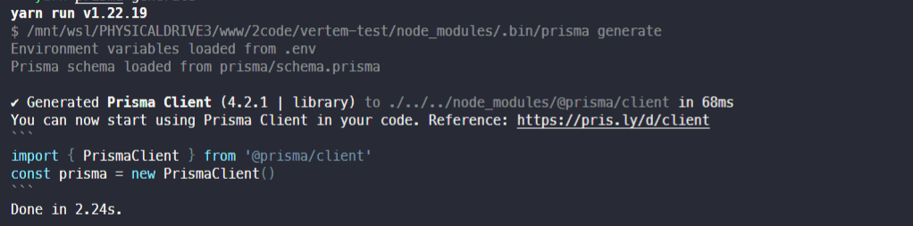

# PREMMIAR - Frontend

[](mailto:bgarciamoura@gmail.com)
[](https://www.linkedin.com/in/bgarciamoura/)

⭐️ Please, star me on GitHub — it helps!

## Table of contents

- [PREMMIAR - Frontend](#premmiar---frontend)
	- [Table of contents](#table-of-contents)
	- [Introduction](#introduction)
	- [Technologies](#technologies)
	- [Setup and Running](#setup-and-running)
	- [Thanks](#thanks)

## Introduction

This is a simple CRUD application for Premmiar job. In this project i've been using turborepo as my monorepo tool, so i can develop my backend and frontend in one repository.

## Technologies

Project is created with:

- [Nodejs](https://nodejs.org/)
- [Reactjs](https://reactjs.org/)
- [TypeScript](https://www.typescriptlang.org/)
- [Turborepo](https://turborepo.org/)
- [Expressjs](https://expressjs.com/)
- [Prisma](https://www.prisma.io/)
- [Vite](https://vitejs.dev/)
- [VsCode](https://code.visualstudio.com/)
- [Markdown](https://www.markdownguide.org/)

## Setup and Running

To run this project you have to install the dependencies, initialize the prisma client and the database then, run the project. To do that you have to run the following commands:

The first thing is to install the dependencies:

```bash:
yarn install
```

The second thing is to initialize the prisma client and the database, first go to backend folder, in terminal, and run prisma generate command:

```bash:
cd apps/backend && yarn prisma generate
```

Here's the output example:



The third thing is to run the project, in terminal, and run the server command:

```bash:
cd ../.. && yarn dev
```

The turborepo is gonna run the server in the background, so you can see the output in the terminal and the frontend in the browser. The backend is running in port 3333 and the frontend is running in port 5173.

## Thanks

It was a huge pleasure to participate of the [Premmiar](https://premmiar.com.br/) recruitment process for the frontend position. I really hope you all enjoy my solution. Thanks for the opportunity!
